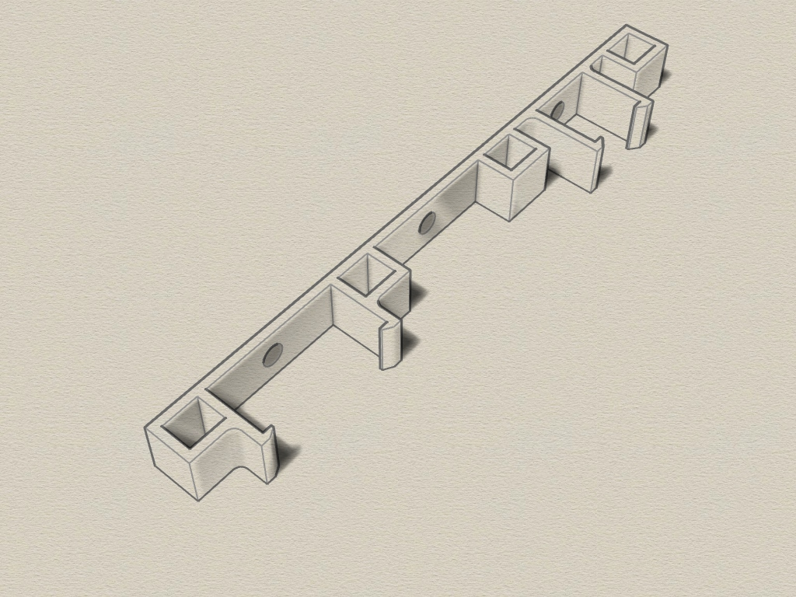
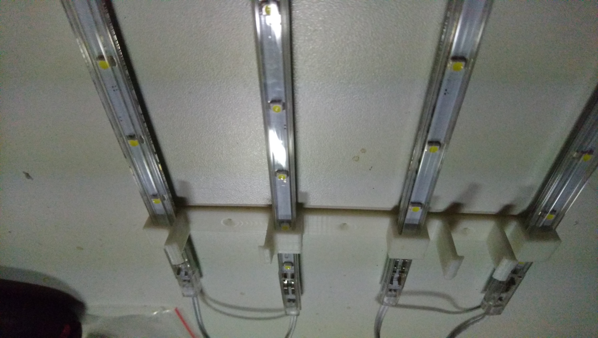
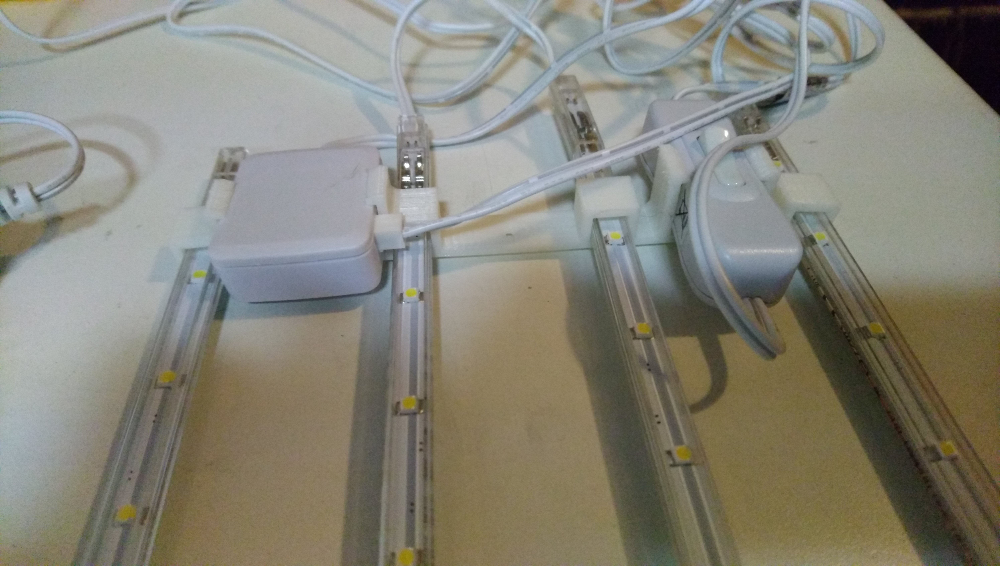

# LED-strip-holder
3D printable LED strip holder for 4 LED strips 8,3 x 7 mm. Created with Rhino 6.

## 3D LED-strip-holder

The LED strip holder consists of 2 parts which are screwed to a surface.

Requirements:
* 3D printer 
* Filament of your choice
* 6 x 2x12mm Spax (wood) screws 

## View
 
 
 
